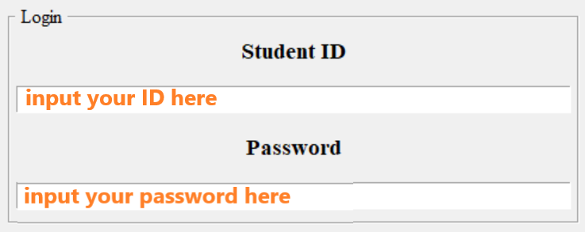
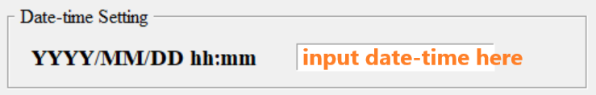
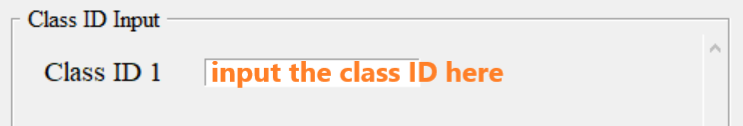
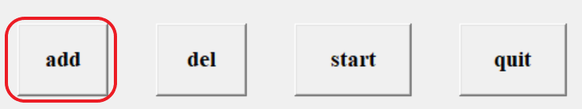
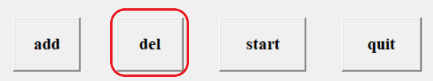
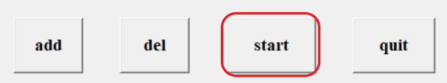
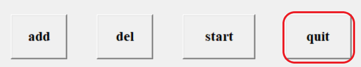

# AutoClassChoosing

## How to use it?

### Login

### Date-Time Setting

Input the starting time of the class choosing.
Format: YYYY/MM/DD hh:mm
e.g. 2023/01/01 13:14

### Class ID input

Input all the class ID you want to choose.

#### add entry

If you want to choose more classes, you can click the add button to get more entries for input.

#### delete entry

If the entries is enough for you, you can click del button to delete the entry that you didn't use.

#### start the program

As you finished all the settings, you can click the start button to let the program count down, and wait for the result.

#### quit the program

As the program is done or you want to abort the program, you can click the quit button to close the window.

